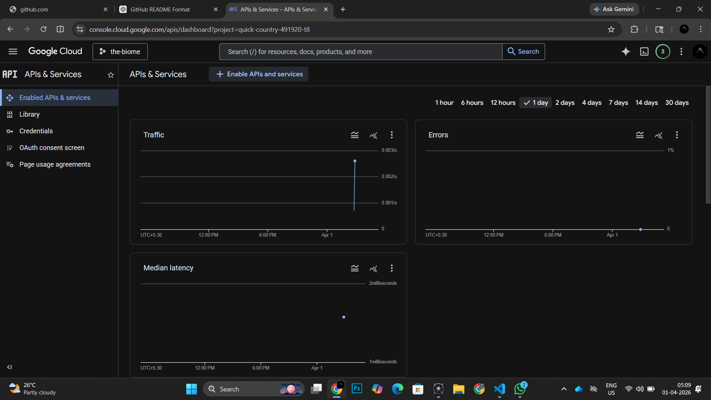
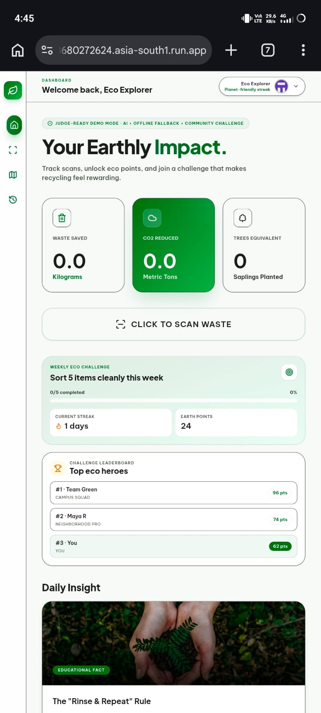
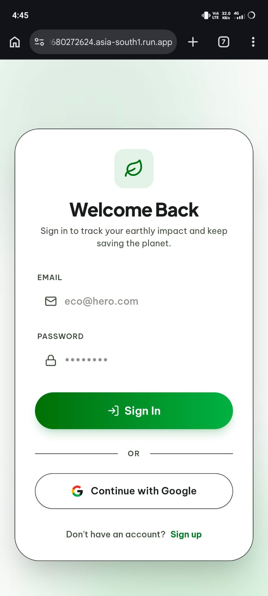
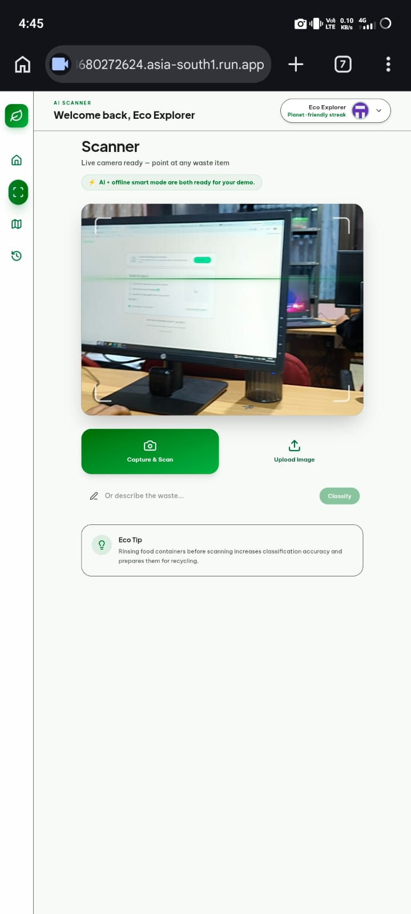
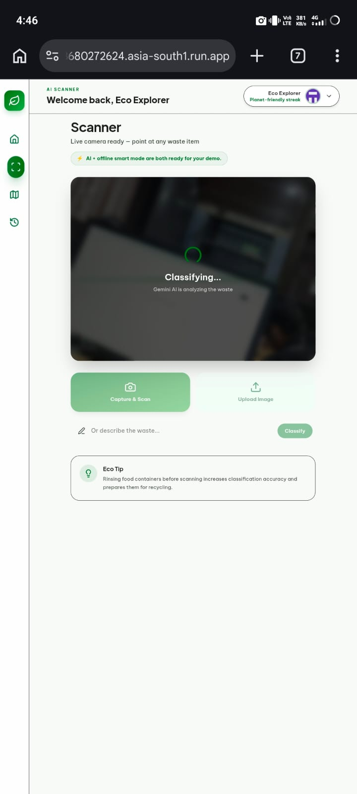

# 🌱 The-Diome

[](https://the-biome-313680272624.asia-south1.run.app/)
[](https://github.com/alanjoyes7/sustainable-future)
[]()
[]()

---

## 📌 Problem Statement

The world is facing increasing environmental challenges such as climate change, unsustainable resource usage, and lack of awareness about eco-friendly practices. Many individuals struggle to understand their environmental impact and take meaningful action toward sustainability.

---

## 💡 Project Description

**The-Diome** is an AI-powered sustainability platform that helps users track, analyze, and improve their environmental impact.

### 🔧 Features

* ♻️ AI-powered waste classification (camera + upload)
* 📊 Environmental impact tracking (CO2, waste, trees)
* 🏆 Gamified leaderboard & eco challenges
* 📅 Weekly sustainability tasks
* 🧠 Daily eco insights powered by AI

### 🚀 How it works

* User scans waste using camera or uploads image
* Google AI (Gemini) analyzes and classifies waste
* System calculates environmental impact
* Users earn eco points and track progress

---

## 🧠 Google AI Usage

### 🛠️ Tools / Models Used

* Google AI Studio
* Gemini API
* Google Cloud Run

### ⚙️ How Google AI Was Used

* Gemini AI is used to classify waste from images
* Generates eco tips and sustainability insights
* Provides intelligent responses in real-time
* Enables smart environmental decision-making

---

## 📸 Proof of Google AI Usage



---

## 🖼️ Screenshots

### 🔐 Authentication Page



### 📊 Dashboard



### 📷 AI Waste Scanner



### 🤖 AI Classification in Progress



---

## 🎥 Demo Video

📺 **Watch Demo:**
https://drive.google.com/file/d/14tfx8kxOutwYGyv5fxfGBWnZu0oEzh_J/view?usp=drive_link

---

## ⚙️ Installation Steps

```bash
# Clone the repository
git clone https://github.com/alanjoyes7/sustainable-future.git

# Navigate into the project
cd sustainable-future

# Install dependencies
npm install

# Start the development server
npm start
```

---

## 🏗️ Tech Stack

* **Frontend:** HTML / CSS / JavaScript
* **Backend:** Node.js
* **AI:** Google Gemini API
* **Deployment:** Google Cloud Run

---

## 🌍 Future Scope

* 📱 Mobile app version
* 🌐 Real-time environmental data integration
* 🧑‍🤝‍🧑 Community features
* 📊 Advanced analytics dashboard

---

## 👨‍💻 Contributors

* [Alan Joyes](https://github.com/alanjoyes7)
* [Adwaith P. S]

---

## ⭐ Support

If you like this project, give it a ⭐ on GitHub!
